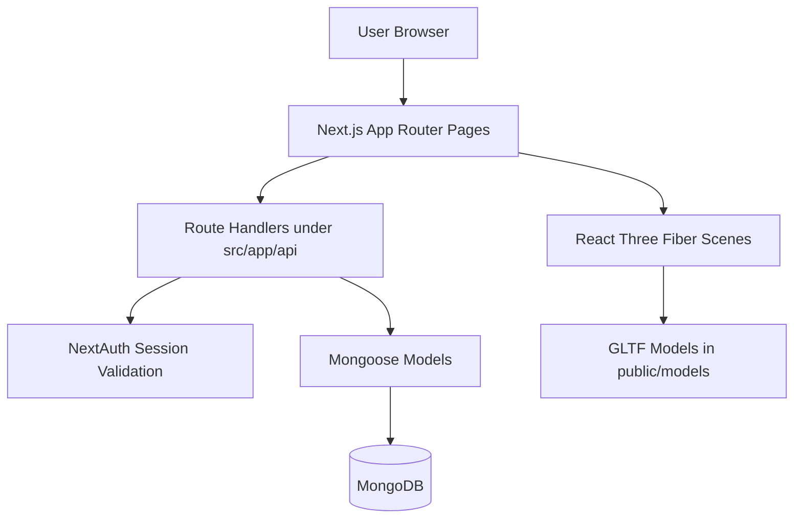

# Devrary

A 3D virtual software-learning library built with Next.js App Router, NextAuth, MongoDB, and React Three Fiber.

## What This Project Does

Devrary maps learning into a spatial library model:

- Room: domain view and navigation
- Shelf: technology/language grouping
- Book: concept entry
- Page: structured content sections

Users can browse rooms, open shelves, search books, bookmark books, and create draft books. Admin users can approve or reject submitted drafts.

## Architecture Overview



```mermaid
flowchart LR
	H[/] --> R[/room]
	R --> L[/library/:room-name]
	L --> S[/api/shelf]
	L --> B[/api/books/:bookID]
	H --> Q[/books/search]
	H --> K[/books/bookmarks]
	H --> C[/books/create]
	H --> P[/profile]
	H --> A[/books/approve-books]
```

## Tech Stack

| Layer | Libraries / Tools |
|---|---|
| Framework | Next.js 16.1.6 (App Router), React 19.2.3, TypeScript |
| Styling/UI | Tailwind CSS v4, shadcn/ui-style components, Framer Motion |
| 3D | three, @react-three/fiber, @react-three/drei |
| Auth | next-auth v4 (Google provider, JWT session strategy) |
| Data | MongoDB, mongoose |
| Forms/Validation | react-hook-form, zod, @hookform/resolvers |
| Utilities | lucide-react, uuid, clsx, class-variance-authority |

## Key Features

| Feature | Description | Source |
|---|---|---|
| 3D Landing Experience | Interactive homepage with animated bookshelf model and hover-driven quote bubble | src/app/page.tsx |
| Room Selection | 3D room grid with animated camera travel and route transition | src/app/room/page.tsx |
| Shelf + Book Navigation | Dynamic room route with shelves, shelf index panel, and book overlay reader | src/app/library/[room-name]/page.tsx |
| Search | Debounced live search against MongoDB Atlas Search index | src/app/books/search/page.tsx, src/app/api/search/route.ts |
| Bookmarks | Add/remove bookmarks and fetch user bookmarks | src/app/books/bookmarks/page.tsx, src/app/api/bookmarks/route.ts |
| Book Creation | Client page for drafting structured books with sections/pages | src/app/books/create/page.tsx |
| Admin Moderation | Admin review queue with approve/reject flow | src/app/books/approve-books/page.tsx |
| Profile Dashboard | Server-rendered profile summary with created books and bookmarks | src/app/profile/page.tsx |

## Route Map

### App Pages

| Route | Purpose | Auth |
|---|---|---|
| / | Landing page with animated hero and bookshelf model | Public |
| /room | Room selection scene | Public |
| /library/[room-name] | Room shelf explorer and book reading overlay | Public |
| /books/search | Search published books | Public |
| /books/bookmarks | User bookmark list | Protected by middleware |
| /books/create | Create draft books | Protected by middleware |
| /books/approve-books | Admin moderation page | Protected + admin-only redirect |
| /profile | User profile and activity summary | Protected by middleware |
| /test | Experimental page | Public |

### API Endpoints

| Method | Endpoint | Description | Auth Requirement |
|---|---|---|---|
| GET/POST | /api/auth/[...nextauth] | NextAuth handler | NextAuth managed |
| GET | /api/bookmarks/all | Get current user bookmark IDs | Session required for non-empty result |
| POST | /api/bookmarks | Add/remove bookmark | Authenticated session |
| GET | /api/books/[bookID] | Get normalized book payload; fallback to defaultBook.json if missing | Public |
| POST | /api/books/create | Create book draft with generated draft ID | Authenticated session |
| GET | /api/books/drafts | List draft books | Public endpoint (UI uses admin gate) |
| POST | /api/books/approve | Approve draft and convert to published ID | Admin |
| POST | /api/books/reject | Delete draft | Admin |
| GET | /api/search?q=... | Atlas Search across name/description/author and published status | Public |
| GET | /api/shelf?shelf=n | Fetch books for a shelf index | Public |

## Authentication and Access Control

- Provider: Google OAuth via NextAuth.
- Session strategy: JWT.
- User auto-provisioning occurs on first sign-in.
- Middleware protects:
	- /books/create
	- /books/bookmarks
	- /profile
	- /settings
	- /books/approve-books
- Non-authenticated users are redirected to Google sign-in.
- /books/approve-books additionally requires token role admin.

## Data Model Summary

### User

| Field | Type | Notes |
|---|---|---|
| email | string | unique, required |
| name | string | lowercase username format validation |
| profilePicture | string | optional |
| role | user \| admin | default user |
| bookmarks | string[] | array of book IDs |
| createdAt / updatedAt | Date | mongoose timestamps |

### Book

| Field | Type | Notes |
|---|---|---|
| _id | string | custom ID schema (draft/published patterns) |
| name | string | required |
| description | string | required |
| author | string | required |
| duration | string | required |
| variant | thin \| medium \| thick | default medium |
| tags | string[] | optional |
| pages | page[] | structured sections |
| creator | string | session user email |
| status | draft \| published | default draft |
| createdAt / updatedAt | Date | mongoose timestamps |

## Book ID Conventions

| Type | Pattern | Example |
|---|---|---|
| Draft | draft_{difficulty}b{random}-{domain}-{langCode} | draft_l1b123-web-dev-0 |
| Published | {difficulty}b{sequence}-{domain}-{langCode} | l1b4-web-dev-0 |

Language code map used by creation and lookup:

| Language | Code |
|---|---|
| javascript | 0 |
| typescript | 1 |
| go | 2 |
| c++ | 3 |
| rust | 4 |
| python | 5 |

## Environment Variables

Create a local env file with at least the following:

| Variable | Required | Purpose |
|---|---|---|
| MONGODB_URI | Yes | MongoDB connection string |
| AUTH_GOOGLE_ID | Yes | Google OAuth client ID |
| AUTH_GOOGLE_SECRET | Yes | Google OAuth client secret |
| NEXTAUTH_SECRET | Recommended | NextAuth signing secret |
| NEXTAUTH_URL | Recommended in production | Canonical app URL |

Note: search uses MongoDB Atlas Search with index name search in src/app/api/search/route.ts.

## Local Development

### Prerequisites

- Node.js 18+
- pnpm (recommended), npm, or yarn
- MongoDB instance (Atlas or local)
- Google OAuth app credentials

### Install and Run

```bash
pnpm install
pnpm dev
```

Open http://localhost:3000.

### Useful Scripts

| Command | Description |
|---|---|
| pnpm dev | Start development server |
| pnpm build | Production build |
| pnpm start | Start production server |
| pnpm lint | Run ESLint |

## Project Structure

| Path | Responsibility |
|---|---|
| src/app | App Router pages and API route handlers |
| src/app/api | Backend endpoints for auth, books, bookmarks, search, shelf |
| src/components/custom | 3D and custom UI components (shelf, navbar, flipbook, etc.) |
| src/components/ui | Reusable UI primitives |
| src/lib/models | Mongoose schemas (User, Book) |
| src/lib/mongodb.ts | DB connection helper |
| public/models | GLTF models for 3D scenes |
| public/covers | Cover assets resolved by language |
| src/middleware.ts | Route protection and admin guard |

## Notes and Current Behavior

- The dynamic room route accepts any room slug and formats a display title from the URL segment.
- /api/books/[bookID] returns normalized fallback data when the book does not exist.
- /api/books/drafts currently returns drafts without explicit server-side role checking; admin gating is enforced in middleware and page flow.
- next.config.ts allows remote profile images from avatars.githubusercontent.com, cdn.discordapp.com, and lh3.googleusercontent.com.

## Deployment Checklist

1. Set all required environment variables.
2. Configure Google OAuth callback URLs for the deployed domain.
3. Ensure MongoDB Atlas Search index search exists for the books collection.
4. Run production build and smoke test protected routes.

---

If you want, the next improvement can be an API reference section with example request/response payloads for each endpoint.